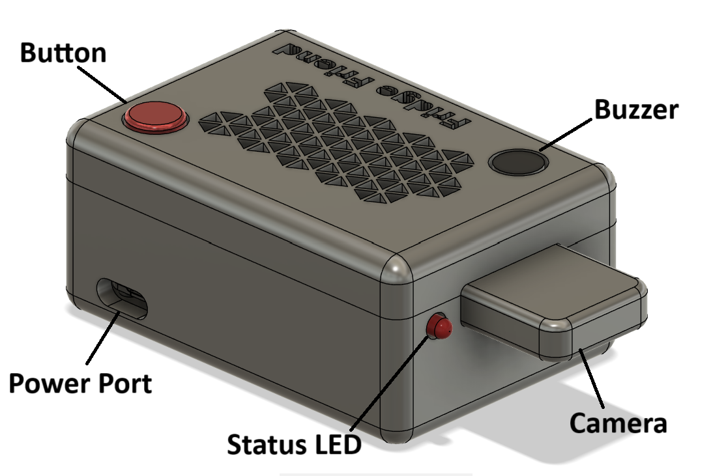
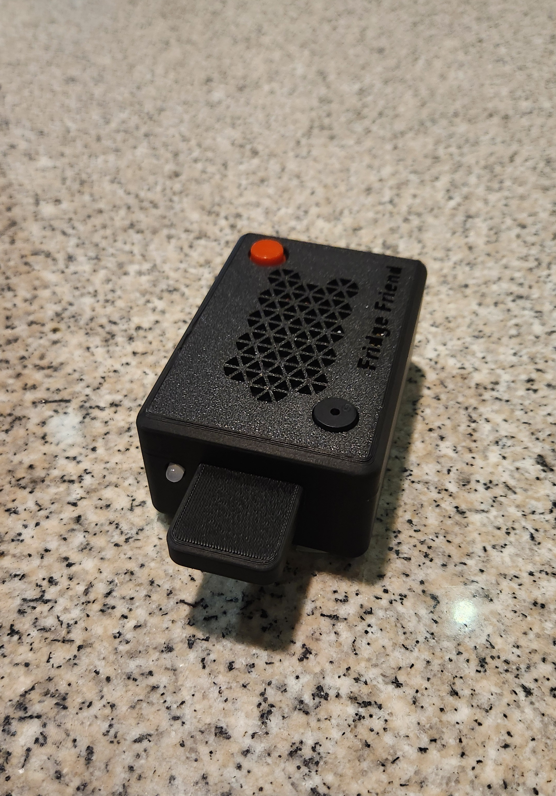

# Fridge Friend
In today's fast-paced world, food waste and dietary concerns are becoming issues of increasing concern. With many people spending upwards of eight hours per day at work or school, families often struggle to keep their refrigerators organized. Without a system to track the groceries in the fridge, ingredients are often forgotten and ultimately wasted. Additionally, simple, nutritious and tailored recipes can be hard to come by without specific knowledge of the ingredients within the fridge.
Fridge Friend offers a unique and innovative solution to these challenges by addressing both nutritional concerns and food waste. Utilizing a fine-tuned machine learning model, Fridge Friend tracks all items entering and leaving the fridge and suggests recipes based on available ingredients. It detects when food items are being placed into or taken out of the fridge then identifies. This data is then sent to a cloud server, allowing users to access a complete list of their ingredients through an integrated user interface. With nutrition and simplicity at the forefront, tailored recipes can be suggested based on the user's available ingredients.

